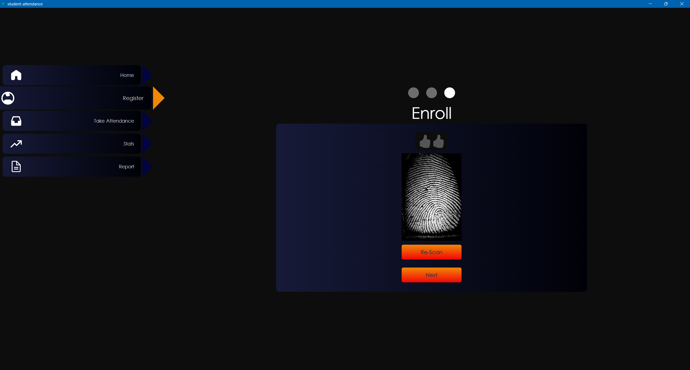

# Student Biometrics Attendance System - FUTMINNA

## Table of Contents

- [Introduction](#introduction)
- [Features](#features)
- [Technologies Used](#technologies-used)
- [Installation](#installation)
- [Usage](#usage)
- [Screenshots](#screenshots)
- [Configuration](#configuration)
- [Backup and Sync](#backup-and-sync)
- [Development](#development)
- [Building](#building)
- [Contributing](#contributing)
- [License](#license)

## Introduction

The Student Biometrics Attendance System is a robust desktop application developed for the Federal University of Technology, Minna (FUTMINNA). This system streamlines the process of recording and managing student attendance using biometric fingerprint technology.

## Features

- Biometric fingerprint scanning and matching
- Student attendance tracking
- User-friendly interface built with React
- Local database storage using LowDB
- Google Drive integration for attendance backup
- Cross-platform compatibility (Windows, macOS, Linux)

## Technologies Used

- Electron: Cross-platform desktop app framework
- React: UI library for building user interfaces
- LowDB: Lightweight JSON database
- Futronics FS80: Fingerprint scanner hardware
- Bozorth3: Fingerprint matching algorithm
- Google Drive API: For cloud backup and sync

## Installation

1. Clone the repository:
   ```
   git clone https://github.com/yourusername/student-biometrics-attendance.git
   ```
2. Navigate to the project directory:
   ```
   cd student-biometrics-attendance
   ```
3. Install dependencies:
   ```
   npm install
   ```

## Usage

To start the application in development mode:

```
npm start
```

## Screenshots





## Configuration

### Google API Setup

1. Create a project in the Google Cloud Console.
2. Enable the Google Drive API.
3. Create credentials (OAuth 2.0 Client ID) for a desktop application.
4. Add your credentials to the `.env` file:

```
CLIENT_ID=your-client-id.apps.googleusercontent.com
CLIENT_SECRET=your-client-secret
```

## Backup and Sync

The system automatically backs up attendance data to Google Drive. Ensure you have configured the Google API credentials correctly for this feature to work.

## Development

To run the application in development mode with hot-reloading:

```
npm run watch
npm run electron-start
```

## Building

To create a distribution build:

```
npm run dist
```

This will create executable files for your operating system in the `dist` folder.

## Contributing

Contributions are welcome! Please feel free to submit a Pull Request.

## License

[MIT LICENSE]
